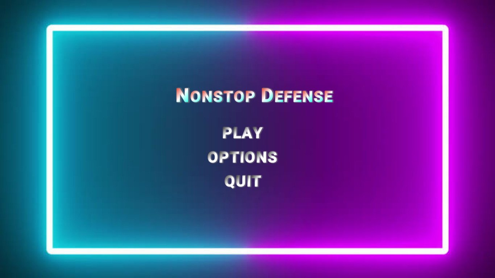
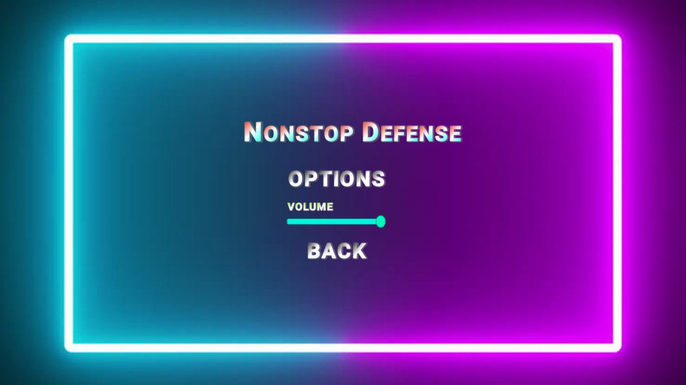
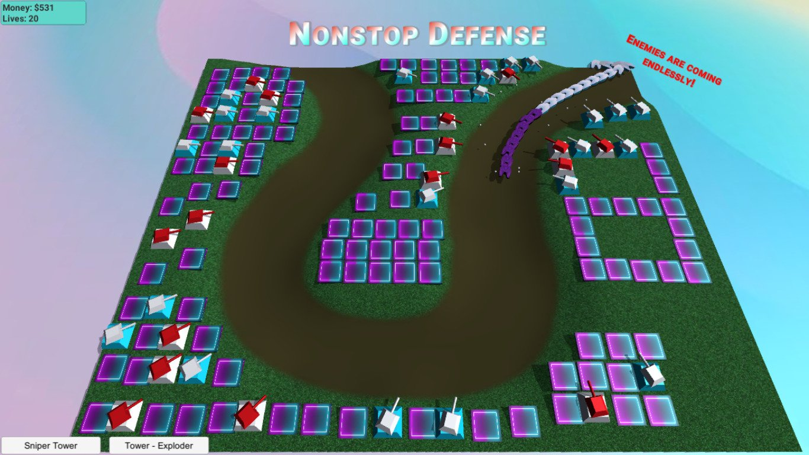
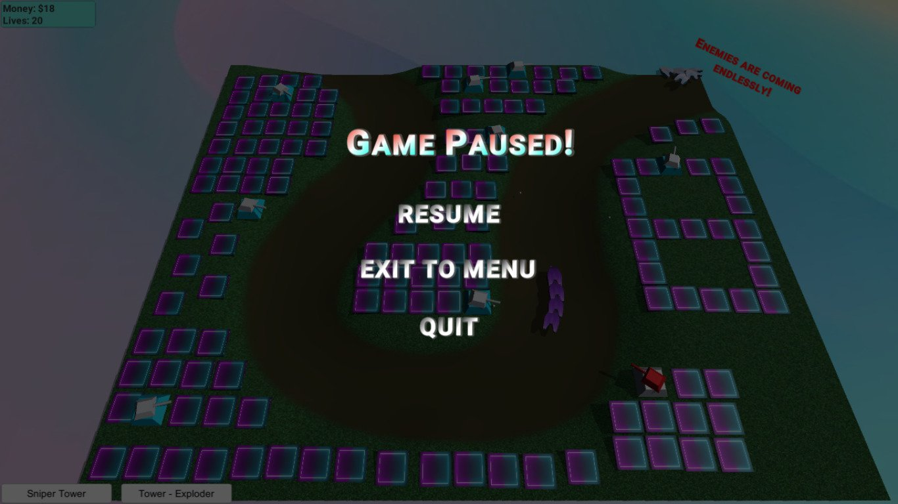
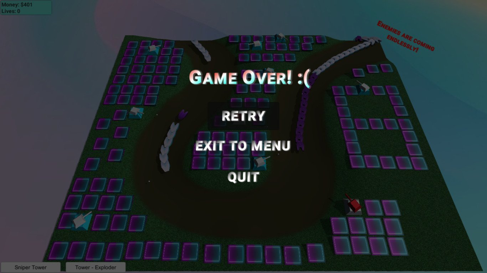

# Nonstop Defense

Permainan bertipe Tower Defense dimana kita sebagai player diharuskan menjaga rumah kesayangan kita dari serangan para cacing besar Alaska yang tidak diketahui jumlah dan kekuatannya. 

Untuk bisa melawan mereka, kita harus membuat benteng pertahanan yang terdiri dari berbagai jenis Turret yang memiliki kelebihannya masing-masing. 

Kita akan kehilangan rumah kesayangan kita apabila 20 cacing besar Alaska memasuki dan mengacak-acak rumah kita. 

### Development Team
<table>
  <th>
    Nama
  </th>
  <th>
    Peran
  </th>
  <tr>
    <td>
      Mickael
    </td>
    <td>
      Project Manager, Game Programmer, Game Designer
    </td>
  </tr>
  <tr>
    <td>
      Muhammad Fauzan Azhim
    </td>
    <td>
      Game Designer, Game Artist
    </td>
  </tr>
  <tr>
    <td>
      Mursyid Alhadi
    </td>
    <td>
      Game Artist
    </td>
  </tr>
</table>

### Technology

| Game Engine | Assets | Other |
| ----- | ----- | ----- |
| *Unity Version 2019.2.9f1* | *Unity Asset Store* | *Audacity* |
|  | *Youtube* | *Visual Studio Community 2019* |
|  | *Blender* | *XBOX Game Bar* |

### Gameplay

Kita hanya perlu membeli jenis Turret yang kita inginkan disesuaikan dengan jumlah Money yang kita miliki saat itu dengan men-klik left-click mouse button dan meletakkannya di Terrain yang sudah disediakan di Map.

| Tombol | Fungsi |
| ----- | ----- |
| Left-click Mouse Button | Membeli Turret, Meletakkan Turret |
| Esc | Pause Game |

### Screenshot 

Main Menu:

Options Menu:

Gameplay:

Game Pause:

Game Over:

### Video Gameplay 
